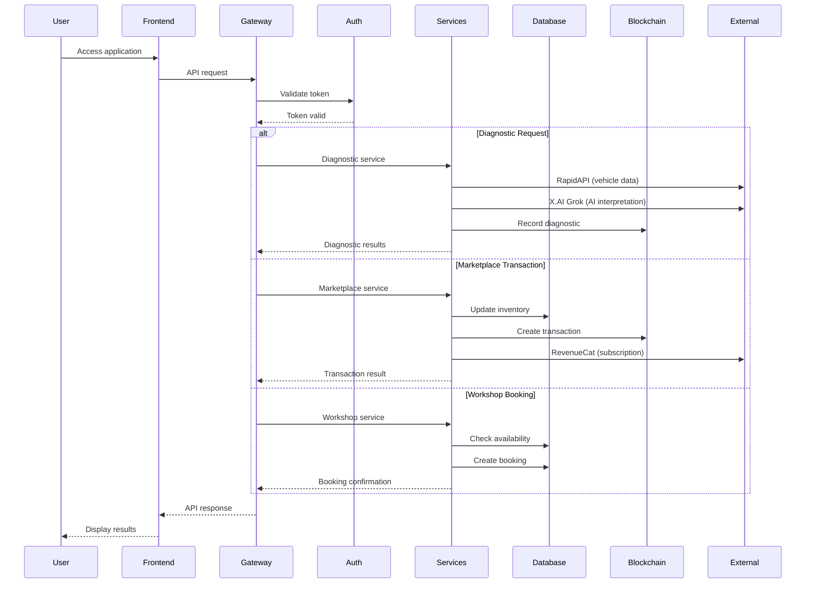
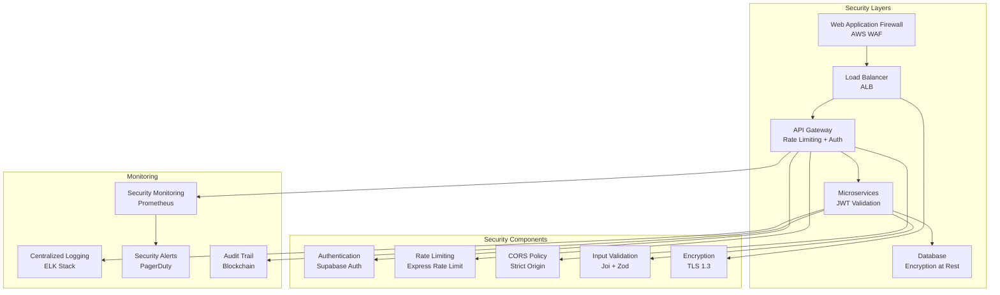
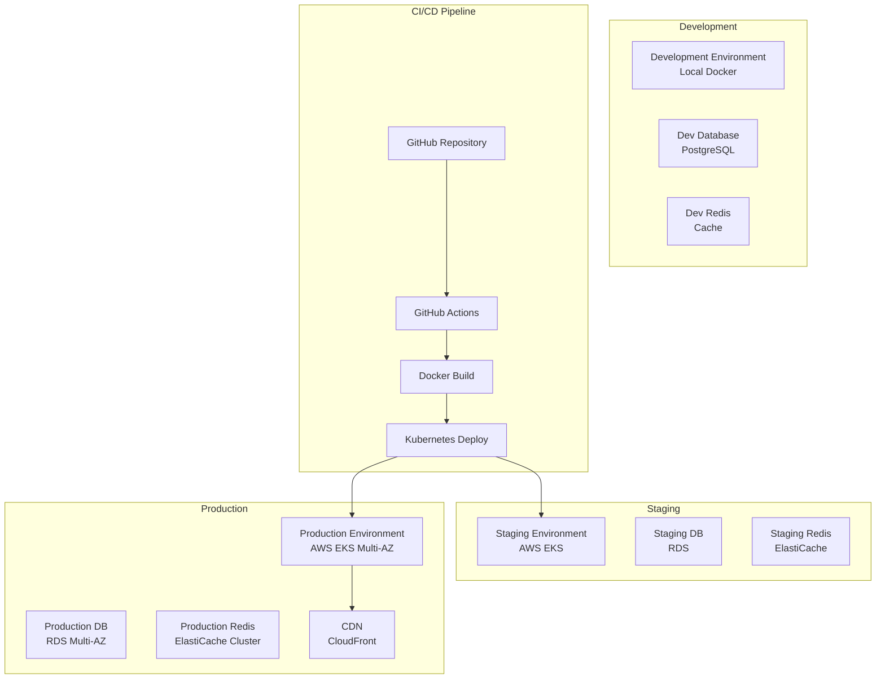

# 🏗️ KC Speedshop Platform Architecture

## System Architecture Diagram

```mermaid
graph TB
    %% User Layer
    subgraph "User Interface"
        WEB[Web Application<br/>React + TypeScript]
        MOBILE[Mobile App<br/>React Native]
        WORKSHOP[Workshop Terminal<br/>Touch Interface]
    end

    %% API Gateway Layer
    subgraph "API Gateway"
        GATEWAY[API Gateway<br/>Node.js + Express]
        AUTH[Authentication<br/>Supabase Auth]
        RATE_LIMIT[Rate Limiting<br/>Express Rate Limit]
    end

    %% Core Services
    subgraph "Core Services"
        USER_SVC[User Service<br/>Profile Management]
        VEHICLE_SVC[Vehicle Service<br/>VIN Management]
        WORKSHOP_SVC[Workshop Service<br/>Bay Booking]
        MARKETPLACE_SVC[Marketplace Service<br/>Parts Trading]
    end

    %% ML/AI Services
    subgraph "ML/AI Services"
        DIAGNOSTIC_SVC[Diagnostic Service<br/>OBD2 + X.AI Grok]
        PREDICTION_SVC[Prediction Service<br/>Predictive Maintenance]
        AI_ASSISTANT[AI Assistant<br/>Conversational AI]
    end

    %% Blockchain Services
    subgraph "Blockchain Services"
        HEDERA_SVC[Hedera Service<br/>Smart Contracts]
        PARTS_AUTH[Parts Authentication<br/>Blockchain Verification]
        PAYMENT_SVC[Payment Service<br/>HBAR Transactions]
    end

    %% Data Layer
    subgraph "Data Layer"
        POSTGRES[(PostgreSQL<br/>Primary Database)]
        REDIS[(Redis<br/>Cache & Sessions)]
        SUPABASE[(Supabase<br/>Real-time + Auth)]
    end

    %% External Integrations
    subgraph "External Services"
        RAPIDAPI[RapidAPI<br/>Vehicle Data]
        XAI[X.AI Grok<br/>AI Interpretation]
        HEDERA_NET[Hedera Network<br/>Blockchain]
        REVENUECAT[RevenueCat<br/>Subscriptions]
    end

    %% Infrastructure
    subgraph "Infrastructure"
        K8S[Kubernetes<br/>AWS EKS]
        MONITORING[Monitoring<br/>Prometheus + Grafana]
        LOGGING[Logging<br/>ELK Stack]
        CDN[CDN<br/>CloudFront]
    end

    %% Connections
    WEB --> GATEWAY
    MOBILE --> GATEWAY
    WORKSHOP --> GATEWAY
    
    GATEWAY --> AUTH
    GATEWAY --> RATE_LIMIT
    
    GATEWAY --> USER_SVC
    GATEWAY --> VEHICLE_SVC
    GATEWAY --> WORKSHOP_SVC
    GATEWAY --> MARKETPLACE_SVC
    GATEWAY --> DIAGNOSTIC_SVC
    GATEWAY --> PREDICTION_SVC
    GATEWAY --> AI_ASSISTANT
    GATEWAY --> HEDERA_SVC
    GATEWAY --> PARTS_AUTH
    GATEWAY --> PAYMENT_SVC

    USER_SVC --> POSTGRES
    VEHICLE_SVC --> POSTGRES
    WORKSHOP_SVC --> POSTGRES
    MARKETPLACE_SVC --> POSTGRES
    
    DIAGNOSTIC_SVC --> REDIS
    AI_ASSISTANT --> REDIS
    
    HEDERA_SVC --> HEDERA_NET
    PARTS_AUTH --> HEDERA_NET
    PAYMENT_SVC --> HEDERA_NET
    
    DIAGNOSTIC_SVC --> RAPIDAPI
    DIAGNOSTIC_SVC --> XAI
    AI_ASSISTANT --> XAI
    
    USER_SVC --> SUPABASE
    AUTH --> SUPABASE
    
    MARKETPLACE_SVC --> REVENUECAT
    
    %% Infrastructure connections
    GATEWAY --> K8S
    POSTGRES --> K8S
    REDIS --> K8S
    
    K8S --> MONITORING
    K8S --> LOGGING
    K8S --> CDN

    %% Styling
    classDef frontend fill:#e1f5fe
    classDef backend fill:#f3e5f5
    classDef ml fill:#e8f5e8
    classDef blockchain fill:#fff3e0
    classDef data fill:#fce4ec
    classDef external fill:#f1f8e9
    classDef infra fill:#e0f2f1

    class WEB,MOBILE,WORKSHOP frontend
    class GATEWAY,AUTH,RATE_LIMIT,USER_SVC,VEHICLE_SVC,WORKSHOP_SVC,MARKETPLACE_SVC backend
    class DIAGNOSTIC_SVC,PREDICTION_SVC,AI_ASSISTANT ml
    class HEDERA_SVC,PARTS_AUTH,PAYMENT_SVC blockchain
    class POSTGRES,REDIS,SUPABASE data
    class RAPIDAPI,XAI,HEDERA_NET,REVENUECAT external
    class K8S,MONITORING,LOGGING,CDN infra
```



## Repository Migration Mapping

### Current State → Target State

| Current Repository | Current Components | Target Location | Migration Priority |
|-------------------|-------------------|-----------------|-------------------|
| `sb1-rhq7ejfc` | React frontend, Supabase auth, Hedera integration | `frontend/src/components/` | High |
| `HBARAUTONZ` | Vanilla JS, OBD2 diagnostics, performance tuning | `frontend/src/pages/diagnostics/` | Medium |
| `studious-couscous/client` | React frontend, full ecosystem UI | `frontend/src/` | High |
| `studious-couscous/server` | Node.js backend, Prisma, PostgreSQL | `backend/src/` | High |
| `KarapiroCartel` | React frontend, AWS EKS deployment | `frontend/src/` + `infrastructure/` | High |

### Component Migration Details

#### Frontend Components
```typescript
// Migration from sb1-rhq7ejfc
src/components/
├── Dashboard/           // Main dashboard
├── Diagnostics/         // OBD2 diagnostic interface
├── Marketplace/         // Parts marketplace
├── Workshop/           // Workshop management
├── Blockchain/         // Hedera integration UI
└── Auth/              // Supabase authentication

// Migration from HBARAUTONZ
src/pages/diagnostics/
├── OBD2Scanner/        // OBD2 scanning interface
├── PerformanceTuning/  // Performance tuning tools
├── HealthScore/        // Vehicle health scoring
└── AIAssistant/        // AI diagnostic chat

// Migration from studious-couscous/client
src/
├── components/         // Shared UI components
├── pages/             // Route-based pages
├── hooks/             // Custom React hooks
├── services/          // API service layer
└── utils/             // Shared utilities
```

#### Backend Services
```typescript
// Migration from studious-couscous/server
backend/src/
├── routes/
│   ├── auth.ts         // Authentication routes
│   ├── vehicles.ts     // Vehicle management
│   ├── diagnostics.ts  // Diagnostic operations
│   ├── marketplace.ts  // Marketplace operations
│   └── blockchain.ts   // Blockchain operations
├── services/
│   ├── diagnosticService.ts
│   ├── blockchainService.ts
│   ├── workshopService.ts
│   └── marketplaceService.ts
└── middleware/
    ├── auth.ts         // JWT validation
    ├── rateLimit.ts    // Rate limiting
    └── validation.ts   // Request validation
```

#### ML/AI Services
```python
# New ML microservice structure
ml/
├── diagnostic-service/
│   ├── app.py          # FastAPI application
│   ├── models/         # ML model artifacts
│   ├── services/
│   │   ├── obd2_service.py
│   │   ├── ai_interpretation.py
│   │   └── prediction_service.py
│   └── notebooks/      # Jupyter notebooks
├── prediction-service/
│   ├── app.py          # Predictive maintenance API
│   ├── models/         # Trained models
│   └── training/       # Model training scripts
└── ai-assistant/
    ├── app.py          # Conversational AI API
    ├── prompts/        # AI prompt templates
    └── integrations/   # X.AI Grok integration
```

#### Blockchain Services
```javascript
// Centralized blockchain service
blockchain/
├── smart-contracts/
│   ├── PartsAuthentication.sol
│   ├── EscrowContract.sol
│   └── PaymentContract.sol
├── services/
│   ├── hederaService.js
│   ├── partsAuthService.js
│   └── paymentService.js
└── scripts/
    ├── deploy.js       // Contract deployment
    └── verify.js       // Contract verification
```

## Data Flow Architecture



## Security Architecture



## Deployment Architecture



## Performance Optimization Strategy

### Frontend Optimization
- **Code Splitting**: Route-based and component-based splitting
- **Lazy Loading**: Images and non-critical components
- **Service Worker**: Offline caching and background sync
- **CDN**: Static asset delivery optimization

### Backend Optimization
- **Redis Caching**: API response caching
- **Database Optimization**: Query optimization and indexing
- **Connection Pooling**: Database connection management
- **Horizontal Scaling**: Kubernetes auto-scaling

### ML Service Optimization
- **Model Serving**: TensorFlow Serving for inference
- **Batch Processing**: Efficient batch predictions
- **GPU Acceleration**: GPU instances for heavy inference
- **Model Compression**: Quantization and pruning

### Blockchain Optimization
- **Transaction Batching**: Batch multiple operations
- **Caching**: Cache blockchain state
- **Async Processing**: Non-blocking blockchain operations
- **Monitoring**: Transaction status tracking

---

**Architecture Version:** 1.0  
**Last Updated:** January 2025  
**Next Review:** After Phase 1 completion